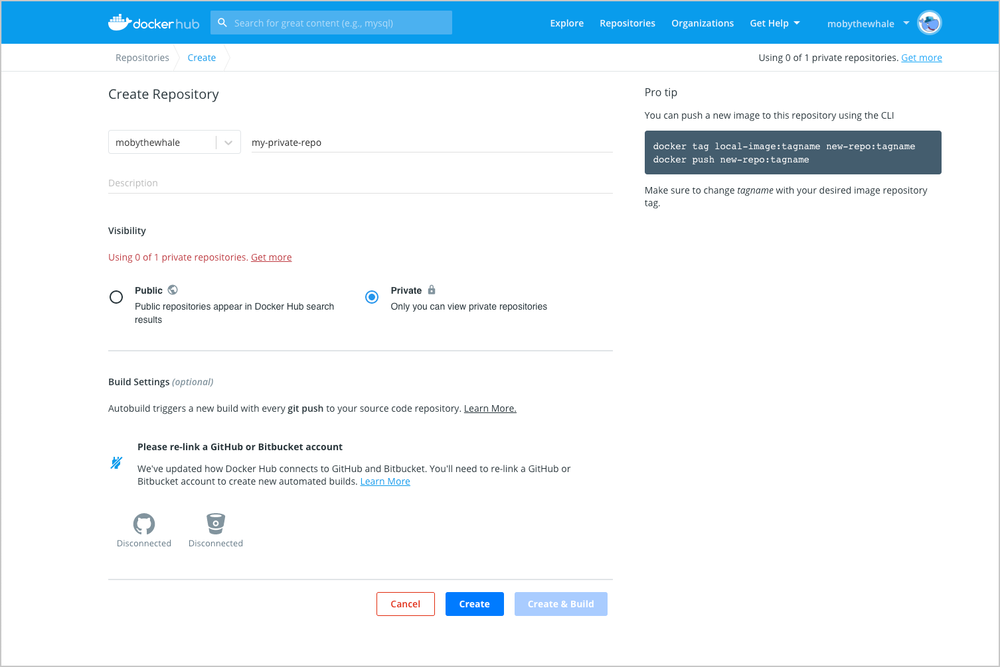
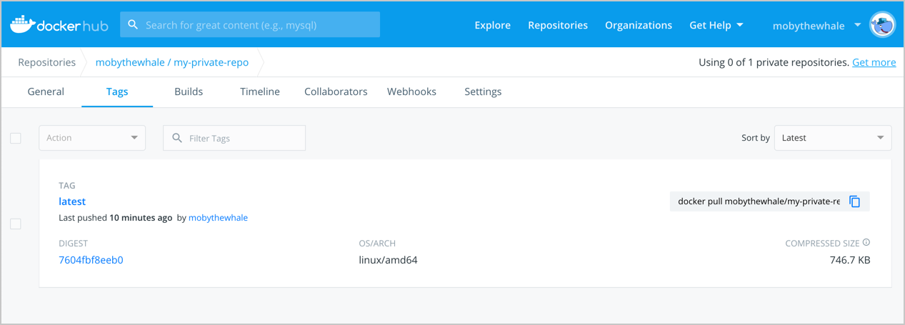

The following section contains step-by-step instructions on how to easily get started with Docker Hub.

### Step 1: Sign up for a Docker account

Let's start by creating a [Docker ID](https://hub.docker.com/signup){: target="_blank" rel="noopener" class="_"}.

A Docker ID grants you access to Docker Hub repositories and allows you to explore images that are available from the community and verified publishers. You'll also need a Docker ID to share images on Docker Hub.

### Step 2: Create your first repository

To create a repository:

1. Sign in to [Docker Hub](https://hub.docker.com){: target="_blank" rel="noopener" class="_"}.
2. Click **Create a Repository** on the Docker Hub welcome page.
3. Name it **&lt;your-username&gt;/my-private-repo**.
4. Set the visibility to **Private**.

    

5. Click **Create**.

    You've created your first repository. You should see:

    

### Step 3: Download and install Docker Desktop

You'll need to download Docker Desktop to build, push, and pull container images.

1. Download and install [Docker Desktop](../desktop/index.md).

2. Sign in to the Docker Desktop application using the Docker ID you've just created.

### Step 4: Pull and run a container image from Docker Hub

1. Run `docker pull hello-world` to pull the image from Docker Hub. You should see output similar to:

   ```console
   $ docker pull hello-world
   Using default tag: latest
   latest: Pulling from library/hello-world
   2db29710123e: Pull complete
   Digest:   sha256:7d246653d0511db2a6b2e0436cfd0e52ac8c066000264b3ce63331ac66dca625
   Status: Downloaded newer image for hello-world:latest
   docker.io/library/hello-world:latest
   ```

2. Run `docker run hello-world` to run the image locally. You should see output similar to:

    ```console
    $ docker run hello-world
    Hello from Docker!
    This message shows that your installation appears to be working correctly.

    To generate this message, Docker took the following steps:
     1. The Docker client contacted the Docker daemon.
     2. The Docker daemon pulled the "hello-world" image from the Docker Hub.
     (amd64)
     3. The Docker daemon created a new container from that image which runs the
     executable that produces the output you are currently reading.
     4. The Docker daemon streamed that output to the Docker client, which sent
     it to your terminal.

    To try something more ambitious, you can run an Ubuntu container with:
     $ docker run -it ubuntu bash

    Share images, automate workflows, and more with a free Docker ID:
     https://hub.docker.com/

    For more examples and ideas, visit:
     https://docs.docker.com/get-started/
    ```

### Step 5: Build and push a container image to Docker Hub from your computer

1. Start by creating a [Dockerfile](../engine/reference/builder.md) to specify your application as shown below:

   ```dockerfile
   # syntax=docker/dockerfile:1
   FROM busybox
   CMD echo "Hello world! This is my first Docker image."
   ```

2. Run `docker build -t <your_username>/my-private-repo .` to build your Docker
   image.

3. Run `docker run <your_username>/my-private-repo` to test your
Docker image locally.

4. Run `docker push <your_username>/my-private-repo` to push your Docker image to Docker Hub. You should see output similar to:

    

    >**Note**
    >
    > You must be signed in to Docker Hub through Docker Desktop or the command line, and you must also name your images correctly, as per the above steps.

5. Your repository in Docker Hub should now display a new `latest` tag under **Tags**:

    

Congratulations! You've successfully:

- Signed up for a Docker account
- Created your first repository
- Pulled an existing container image from Docker Hub
- Built your own container image on your computer
- Pushed it successfully to Docker Hub

### Next steps

- Create an [organization](orgs.md) to use Docker Hub with your team.
- Automatically build container images from code through [builds](builds/index.md).
- [Explore](https://hub.docker.com/explore) official & publisher images.
- [Upgrade your subscription](https://www.docker.com/pricing) to push additional private Docker images to
Docker Hub.
